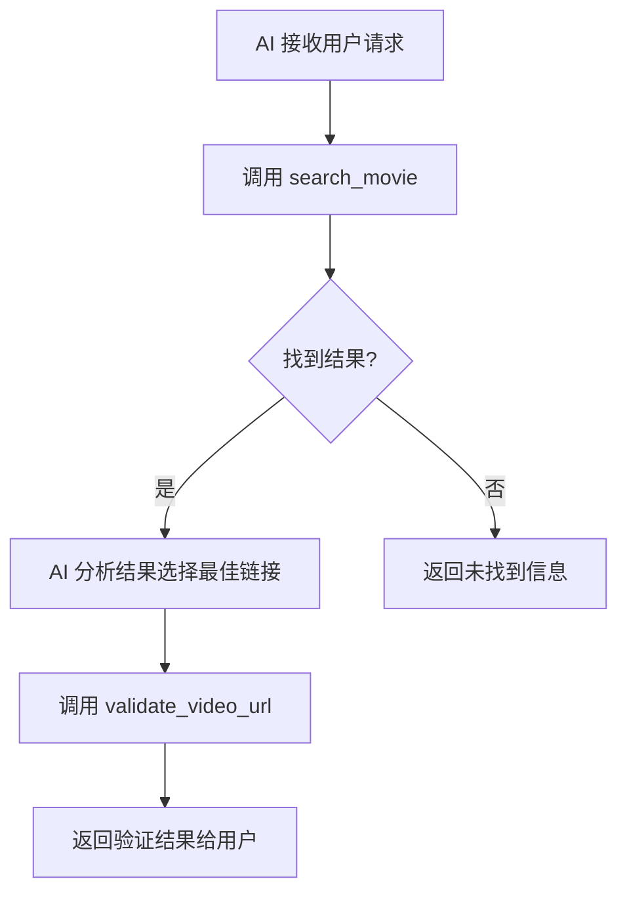

# MCP 使用指南

## 概述

本项目提供了两个版本的 MCP (Model Context Protocol) Server：

- **标准版本** (`src/mcp-server.ts`) - 使用 STDIO 传输
- **SSE 版本** (`src/mcp-server-sse.ts`) - 使用 Server-Sent Events，支持实时通知

## 工具优化

根据 MCP 最佳实践，我们对工具进行了以下优化：

### 1. 清晰的工具描述

- **search_movie**: 明确说明返回未验证的搜索结果，并指导 AI 如何使用后续工具
- **validate_video_url**: 专门用于验证特定链接的可播放性

### 2. 结构化返回格式

所有工具现在返回 JSON 格式的结构化数据，而不是纯文本，包含：

- `success`: 操作是否成功
- `results`: 具体结果数据
- `next_action`: 建议的下一步操作
- `timestamp`: 时间戳（验证工具）

### 3. 优化的工作流程



## 可用工具

### search_movie

**描述**: 搜索电影或电视剧资源。返回未验证的搜索结果列表，包含标题、链接和质量信息。使用此工具获取候选资源后，请从结果中选择最匹配的链接，然后使用 validate_video_url 工具验证其可播放性。

**参数**:

- `title` (string, 必需): 电影或电视剧的标题
- `type` (enum, 必需): "movie" 或 "tv"
- `season` (number, 可选): 季数（仅限电视剧）
- `episode` (number, 可选): 集数（仅限电视剧）

**返回格式**:

```json
{
  "success": true,
  "title": "电影标题",
  "type": "movie",
  "total": 5,
  "results": [
    {
      "id": 1,
      "url": "https://example.com/play/123",
      "quality": "1080P",
      "source": "来源网站",
      "verified": false
    }
  ],
  "next_action": "请从上述结果中选择最合适的链接，然后使用 validate_video_url 工具验证其可播放性"
}
```

### validate_video_url

**描述**: 验证特定视频链接的可播放性。接收一个视频播放页面的 URL，返回该链接是否可以正常播放。只有通过验证的链接才能确保用户可以观看。

**参数**:

- `url` (string, 必需): 要验证的视频播放页面 URL

**返回格式**:

```json
{
  "success": true,
  "url": "https://example.com/play/123",
  "valid": true,
  "status": "可播放",
  "message": "视频链接验证成功，可以正常播放",
  "timestamp": "2024-01-01T12:00:00.000Z"
}
```

## 启动方式

### 标准版本 (STDIO)

```bash
npm run mcp-server
```

### SSE 版本 (推荐)

```bash
npm run mcp-server-sse
```

## 配置文件

### Claude Desktop 配置 (标准版本)

文件位置: `mcp-config.json`

```json
{
  "mcpServers": {
    "movie-search-tool": {
      "command": "node",
      "args": ["dist/mcp-server.js"],
      "cwd": "/path/to/your/project"
    }
  }
}
```

### Claude Desktop 配置 (SSE 版本)

文件位置: `mcp-config-sse.json`

```json
{
  "mcpServers": {
    "movie-search-tool-sse": {
      "url": "http://localhost:3000/mcp"
    }
  }
}
```

## 测试工具

### 测试标准版本

```bash
node test-mcp.js
```

### 测试 SSE 版本

```bash
node test-mcp-sse.js
```

## 优化特点

### 1. 减少 Token 使用

- 返回结构化 JSON 而非冗长文本
- 明确的工具职责分离
- 避免不必要的数据传输

### 2. 改进的 AI 交互

- 清晰的工具描述指导 AI 正确使用
- 结构化数据便于 AI 解析和处理
- 明确的 `next_action` 指导后续操作

### 3. 更好的用户体验

- SSE 版本提供实时进度通知
- 分步骤验证，用户可选择最佳结果
- 详细的错误信息和状态反馈

## 环境要求

- Node.js 18+
- TypeScript 5+
- 所需依赖已在 `package.json` 中定义

## 故障排除

### 常见问题

1. **连接失败**: 确保端口 3000 未被占用（SSE 版本）
2. **验证超时**: 检查网络连接和目标网站可访问性
3. **搜索无结果**: 尝试使用不同的关键词或检查网络连接

### 日志查看

所有版本都会在控制台输出详细的调试信息，包括：

- 搜索进度
- 验证状态
- 错误详情
- 性能指标
